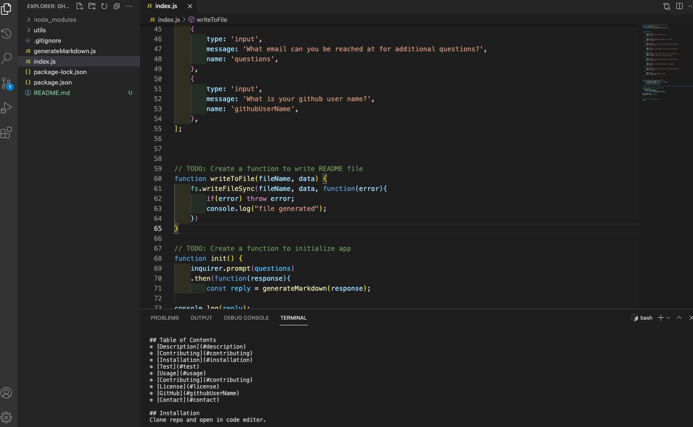

# Ghost Writer

[Video Demo](https://youtu.be/gLppZr5VgYQ)

## Table of Contents

- [Description](#description)
- [Contributing](#contributing)
- [Installation](#installation)
- [Test](#test)
- [Usage](#usage)
- [Contributing](#contributing)
- [License](#license)
- [Contact](#contact)

## Installation

Clone repo and open in code editor.

## Usage

This program’s index.js file is meant to be executed within the Node.js runtime environment wherein the inquirer npm has been installed.

## Description

This README generator will take your input about your project and produce a fully formated markdown document.

## Contributing

Please open an issue if you are interested in contributing to this project.

## Test

No tests available at this time.

## License

This project (and all code) is licensed under the [Apache license](https://opensource.org/licenses/Apache-2.0)

## Contributing

Please open an issue if you are interested in contributing to this project.

## Contact

if you have any questions feel free to reach out by [email](mailto:sissyhanks@yahoo.com) or visit my [Github](https://github.com/sissyhanks)
